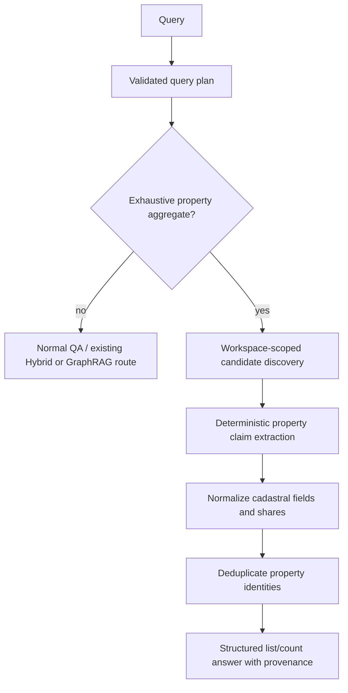
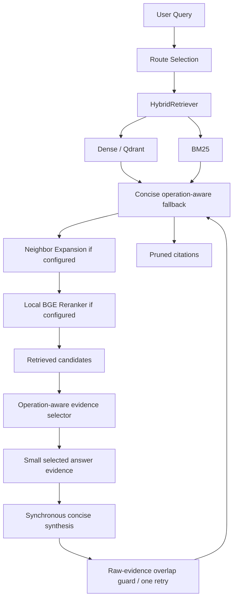

# Query & Answer Pipeline

## Ordinary hybrid query

## Verified property aggregation

The validated query plan makes the route decision before normal retrieval. Only plans with
explicit exhaustive LIST/COUNT/grouping semantics, a `property` target, and aggregation flags
enter this route; describe, identify, timeline, broad, and document-lookup queries stay on their
existing paths.

Candidate discovery processes active workspace entity/domain candidates rather than increasing
Hybrid top-k. Claims preserve source IDs and original shares; fractions reduce deterministically.
The renderer states the active-workspace completeness boundary, and a count is definitive only
after complete extraction and deduplication.

Cadastral extraction is deterministic and label-bound. `pafta`, `ada`, `parsel`, and independent
section values are parsed independently in number-first and label-first forms; absent labels remain
null. The shared display builder emits only known field/value pairs, so incomplete evidence cannot
create empty legal suffixes or positional field shifts.

`route == "hybrid"` is an execution decision, not a stored label. The synchronous chat
path calls `app.retrieval.runtime.HybridRetrievalRuntime`, which composes the existing
workspace-scoped retrieval boundaries and invokes `HybridRetriever.search()`.

The runtime loads the BM25 index at the workspace's `bm25_chunks` resource path, creates
the query vector with the configured embedding provider/model, and uses the workspace's
active embedding configuration hash for Qdrant chunk searches. Qdrant's required payload
filter prevents cross-workspace results. The Qdrant client and an enabled local reranker are
process-cached; the persisted BM25 index is loaded rather than rebuilt by a query.

Upload completion is separate from retrieval readiness: the worker's ingestion `index` stage builds
the active workspace BM25 and Qdrant projections before its workflow can complete. A failed
embedding, Qdrant, or BM25 operation therefore cannot truthfully produce an indexed ingestion.

`dense_top_k`, `bm25_top_k`, `fusion_candidate_limit`, `reranker_input_limit`, and
`final_evidence_top_k` govern broad retrieval. A deterministic answer-stage selector then applies
resolved-full-name, descriptive-context, numeric/OCR shorthand, stub/fragment, and entity-presence
signals without mutating HybridRetriever ranking. It prefers one useful chunk per logical/document
source where independent evidence is available. `identify_final_evidence_top_k` (3),
`describe_final_evidence_top_k` (5), and `timeline_final_evidence_top_k` (5) bound narrative answer
evidence; the existing generic limit remains for other operations. Document lookup retains a separate,
persisted `document_lookup_final_evidence_top_k` request limit before its evidence is grouped by
logical/source document.

The answer builder continues to consume the common `Evidence` type and generates the existing
citation JSON (`document_id`, `document_version_id`, `chunk_id`, `label`). It does not depend on
Qdrant or BM25 result types.

For normal describe synthesis, selected evidence is instructed to yield compact, distinct supported
facts rather than a category-only answer. Provider output is checked against the allowed citation
set; invalid or absent citation markers cannot become a grounded synthesized answer. The final
cited entries are pruned, deduplicated, and densely renumbered in first-appearance order before the
message is persisted. The API and UI source count consume that same final citation array.

Property-related describe facts classify fractions inside bounded source context before rendering.
Only a locally entity-bound ownership/share expression can provide a share; legal-number, date,
and unknown fractions are omitted. Within selected evidence only, compatible duplicate property
facts prefer the richer validated cadastral identity without making an inventory claim.

Before a person-specific property fact is rendered, its selected chunk must contain a direct local
ownership span for the resolved entity. Unbound property candidates and unresolved person mentions
are rejected; this filtering precedes describe-only duplicate cleanup and final citation pruning.

## Degradation and trace data

Dense failures (embedding or Qdrant) leave BM25 available; a missing/corrupt BM25 index leaves
dense retrieval available. The associated sanitized component failure is returned in the message
metadata. An unavailable configured local BGE model returns fused evidence with a `partial`
answer state, following `LocalBGEReranker`'s existing fallback contract. There is no SQLite
term-occurrence fallback in the normal hybrid path.

Hybrid message metadata includes `retrieval_mode`, per-component execution and candidate counts,
fusion count, reranker input/output counts, and final evidence count. `evidence_selection` records
the candidate count, selected count, deterministic score, and short signals for each candidate;
`synthesis` records eligibility, attempt/success state, provider/model, fallback use, and safe error
codes. Normal identify, describe, timeline, and generic QA answers use a direct-answer contract:
selected chunks are internal provider context, claims are paraphrased, and inline citations follow
their supported sentences. A deterministic guard rejects output with a copied contiguous source span
of 12 or more normalized tokens, retries once with a stricter paraphrase instruction, and preserves
the concise local fallback if synthesis cannot provide compliant output. Citations are built only from
selected evidence and therefore retain its order. This makes it possible to
verify the retrieval components used by a normal chat request without exposing secrets.

## GraphRAG

GraphRAG Local, Global, and DRIFT remain worker-owned native query paths and are not fused with
hybrid results. If `graphrag_query_fallback_to_hybrid` is enabled, the worker calls the same
`HybridRetrievalRuntime` boundary described above; it never reintroduces the former SQLite
lexical scan.

Entity resolution and verified property aggregation are implemented as the separate boundaries
described above. Hybrid and GraphRAG remain distinct execution paths and are not fused. See the
**Sorgu akışı** tab of `/system-map` and `system-map-index.md` for the live diagram/source mapping.
