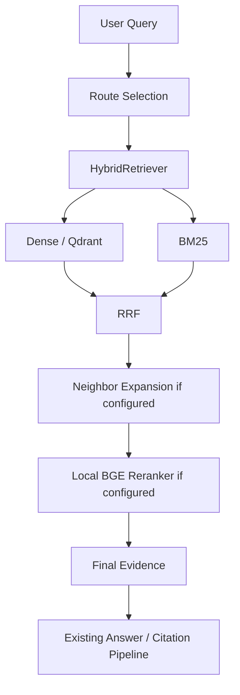

# Query & Answer Pipeline

## Ordinary hybrid query

`route == "hybrid"` is an execution decision, not a stored label. The synchronous chat
path calls `app.retrieval.runtime.HybridRetrievalRuntime`, which composes the existing
workspace-scoped retrieval boundaries and invokes `HybridRetriever.search()`.

The runtime loads the BM25 index at the workspace's `bm25_chunks` resource path, creates
the query vector with the configured embedding provider/model, and uses the workspace's
active embedding configuration hash for Qdrant chunk searches. Qdrant's required payload
filter prevents cross-workspace results. The Qdrant client and an enabled local reranker are
process-cached; the persisted BM25 index is loaded rather than rebuilt by a query.

Upload completion is separate from retrieval readiness: the worker's ingestion `index` stage builds
the active workspace BM25 and Qdrant projections before its workflow can complete. A failed
embedding, Qdrant, or BM25 operation therefore cannot truthfully produce an indexed ingestion.

`dense_top_k`, `bm25_top_k`, `fusion_candidate_limit`, `reranker_input_limit`, and
`final_evidence_top_k` now govern ordinary chat evidence. Document lookup retains a separate,
persisted `document_lookup_final_evidence_top_k` request limit before its evidence is grouped by
logical/source document.

The answer builder continues to consume the common `Evidence` type and generates the existing
citation JSON (`document_id`, `document_version_id`, `chunk_id`, `label`). It does not depend on
Qdrant or BM25 result types.

## Degradation and trace data

Dense failures (embedding or Qdrant) leave BM25 available; a missing/corrupt BM25 index leaves
dense retrieval available. The associated sanitized component failure is returned in the message
metadata. An unavailable configured local BGE model returns fused evidence with a `partial`
answer state, following `LocalBGEReranker`'s existing fallback contract. There is no SQLite
term-occurrence fallback in the normal hybrid path.

Hybrid message metadata includes `retrieval_mode`, per-component execution and candidate counts,
fusion count, reranker input/output counts, and final evidence count. This makes it possible to
verify the retrieval components used by a normal chat request without exposing secrets.

## GraphRAG

GraphRAG Local, Global, and DRIFT remain worker-owned native query paths and are not fused with
hybrid results. If `graphrag_query_fallback_to_hybrid` is enabled, the worker calls the same
`HybridRetrievalRuntime` boundary described above; it never reintroduces the former SQLite
lexical scan.

COUNT, entity resolution, aggregation, query-planner redesign, and Hybrid/GraphRAG fusion remain
out of scope for this pipeline.
