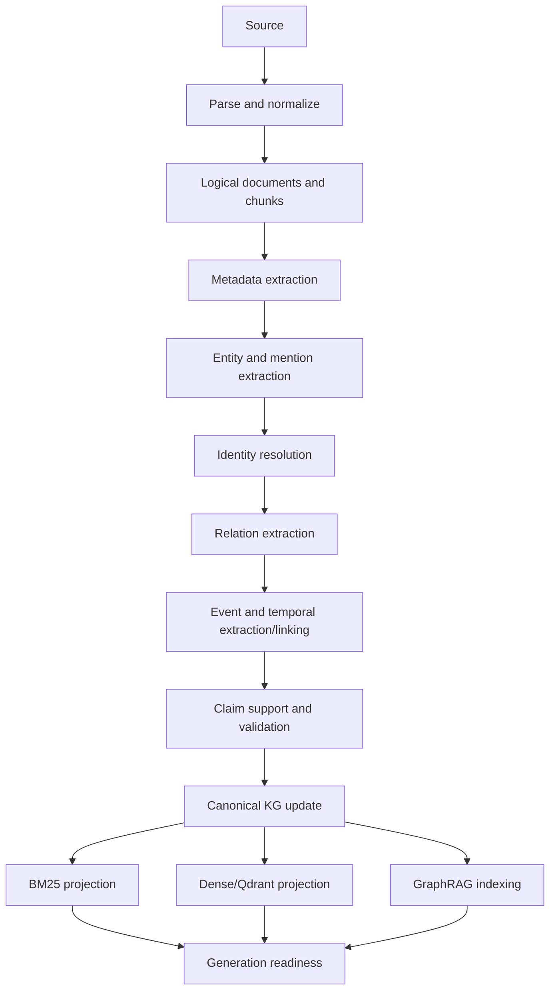

# Query V2 knowledge construction contract

This document defines the target canonical knowledge and indexing architecture. It does not change
the active V1 indexing workflow by itself.

## Knowledge and graph ownership

The upper ontology is deliberately small: `Entity` (including Person, Organization, Location,
Asset/Property and dynamic subtypes), `Document`, `LogicalDocument`, `Event`,
`TemporalExpression`, `Claim`, `Evidence`, and `Fact`. Dynamic domain properties and relations are
schema-governed extensions rather than a growing closed taxonomy.

Neo4j is the persistent/queryable canonical knowledge graph. Raw/extracted and canonical knowledge
are logically separated in the same database with explicit workspace, layer, generation, state,
and provenance markers. Application code never uses the Neo4j driver outside a Cortex-owned graph
adapter. The adapter enforces workspace scope, typed reads/writes, transaction boundaries, and
sanitized trace output.

Microsoft GraphRAG is Neo4j-backed behind its Cortex adapter. Its extraction outputs populate the
raw/extracted layer and may propose canonical changes; they do not become canonical truth merely
because GraphRAG produced them. Local, Global, and DRIFT read their approved views and return typed
findings to the common Result & Evidence Layer.

Phase 03 foundation status: Neo4j Community deployment, authenticated health, the workspace-scoped
graph adapter, extracted/canonical logical labels, atomic GraphRAG extraction synchronization, and
a non-final typed GraphRAG finding envelope are implemented. Native GraphRAG Parquet/JSON remains
the active V1 query source until the later Result & Evidence and sharp-cutover phases.

Phase 04 foundation status: the upper ontology, opaque UUID identity, aliases, original mentions,
exact-source provenance, relation/event/temporal contracts, evidence-gated claim transitions,
explicit contradictions, and precedence are implemented under `app/knowledge/`. The Neo4j adapter
persists canonical entities, claims, facts, conflicts, exact evidence chains, and lossless identity
operations. The workspace curation API/UI exposes merge, split, alias add/remove, evidence
inspection, and history.

Phase 05 delivery status: SQLite persists opaque workspace-scoped candidate generations, durable
run context, and every mandatory checkpoint. The specialized worker snapshots active chunks,
checkpoints provider extraction per chunk, resumes the same candidate after interruption, runs all
model/store calls outside SQLite transactions, and activates only after all eleven matching stages
are ready. BM25 files, Qdrant points, and Microsoft GraphRAG artifacts are generation-scoped.
Readiness is exposed at `GET /workspaces/{workspace_id}/knowledge/readiness` and in the knowledge
curation UI. A failed or mixed-generation candidate cannot replace the prior active generation.

Provider output enters through a typed extraction envelope for mentions, relations, events,
temporals, and claims. Before any promotion, every assertion span must identify a snapshot chunk
and exactly equal the declared substring. Relation/event/claim references must resolve to mentions
inside the same envelope. Temporal `original_text` must equal its exact span, and approximate or
unknown temporal values must retain uncertainty. Successful validation materializes the complete
workspace/document/version/logical-document/chunk/span plus run/provider/model/prompt/schema chain.
The worker-owned provider adapter invokes OpenAI Structured Outputs outside database transactions,
decodes the strict envelope, and applies exact-span validation. Incorrect offsets may be corrected
only when the literal quote has one unambiguous occurrence or one uniquely nearest occurrence.
After bounded model repair, non-literal assertions and their dependent assertions are rejected at
the boundary and counted; they are never promoted. Provider output remains only a proposal until
canonical promotion applies identity and authority rules.

## Identity, claims, and provenance

Canonical entities use stable opaque IDs. Every mention retains original text, exact source span,
normalized form, extraction run, candidate links, decision, confidence, and model/schema versions.
Auto-merge requires conservative evidence; merges, splits, aliases, rejected candidates, and
superseded identities have lossless history. Manual merge, split, alias add/remove, evidence
inspection, and history are first-class curation operations.

The initial conservative auto-link policy requires exactly one same-upper-type candidate with an
exact normalized name and corroboration from at least two evidence records in two distinct document
versions. Any ambiguity remains unresolved. Canonical IDs are UUIDs and never derive from names or
source text. Merge retains one stable primary ID, tombstones superseded identities, transfers active
mention/alias links, and records its sources/results/evidence/reason. Split requires every active
mention to be assigned exactly once, creates new opaque IDs, and retains the source identity plus a
lossless operation record. Alias removal is an inactive user-curated tombstone, not deletion.

Claims move through `ExtractedClaim → SupportedClaim → VerifiedFact`. Support requires source
evidence; verification requires an applicable deterministic or reviewed validator. Conflicting
claims are linked and retained, and facts/relations can expose `conflicted`. User curation outranks
validated knowledge, which outranks extracted proposals.

Every assertion records the source chain through exact span plus extraction run, provider/model,
prompt and schema version, confidence, validation state, generation, and original source text.
Temporal values additionally retain normalized value/range, role, precision, and uncertainty.
The exact span contract requires the declared offset length to equal the preserved source text.
Canonical relations require explicit exact-span, deterministic-rule, or user-curated support;
chunk co-occurrence is not a supported relation source. Approximate and unknown temporal values
must remain marked uncertain.

## Indexing V2 pipeline

Entity, relation, event, temporal, and claim extraction happens at ingestion/indexing time. All
stages are idempotent, workspace-scoped, generation-aware, and provenance-bearing. Reprocessing may
replace extracted proposals for that generation, but it cannot erase higher-precedence curated or
validated decisions. Quality takes priority over cost; selected provider/model and extraction
versions are recorded.

## Generation readiness and cutover

A generation is corpus-complete only when source/relational, entity/mention, identity resolution,
relation, event, temporal, claim/fact, canonical graph, BM25, dense/Qdrant, and GraphRAG stages are
all ready for that exact generation. Mandatory failure, stale output, or cross-generation mixing
blocks activation and exhaustive answers.

V2 migration performs schema/config migration, verifies Neo4j, fully reprocesses source material,
builds all projections, checks completeness, runs acceptance evaluation, and only then atomically
activates the V2 generation. The previous active generation remains available until successful
activation. There is no long-running dual V1/V2 execution mode.

The readiness records are `knowledge_generations` and `knowledge_stage_states`. Stage executors
receive an immutable `CorpusSnapshot` and the opaque candidate generation ID. Their result must
echo both the generation ID and source fingerprint and provide a non-empty output fingerprint.
This prevents a stale external projection from being credited to a newer corpus snapshot.

Phase 13 adds a second, deliberately separate runtime gate. The projection generation may become
active after its eleven same-generation checkpoints pass, but live query routing does not move
from V1 to V2 until schema/config/Neo4j/runtime preflight, a fresh corpus fingerprint, a
before/after user-curation fingerprint, and the acceptance evaluation all pass. The durable
query_runtime_activations row is the only live pointer; every accepted or rejected attempt is
recorded in query_cutover_attempts. Rejection never mutates that pointer.

Neo4j curation preservation is checked over every user-curated canonical entity, alias (including
inactive tombstones), and identity operation. Preflight collection and evaluation happen before
the short SQLite activation transaction. Read-only operational state is exposed at
GET /workspaces/{workspace_id}/knowledge/cutover.
