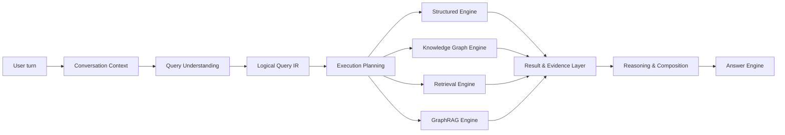

# Query V2 runtime contract

This document defines the target query architecture. It does not describe the active V1 runtime.

## Conversation Context

Conversation Context is first-class, durable conversation-local state. It carries bounded message
history, summaries, last resolved entities, temporal focus, candidate references, explicit user
constraints, and planner-visible assumptions. A follow-up such as “Peki çocukları?” may resolve
against the prior entity, but that resolution never mutates workspace-global canonical knowledge.
Ambiguous carry-over remains explicit.

Phase 06 implements this target behind the inactive V2 boundary. `conversation_contexts` stores one
versioned, optimistically revised state document per workspace/conversation while bounded turns and
the existing summary are read from `messages` and `conversations`. Loads and writes require both
workspace and conversation identity; cited source messages are verified against the same pair.
Planner snapshots are detached before any provider request, and state persistence is a separate
short transaction. Context state never writes to canonical workspace knowledge.

## Query Understanding

The Semantic Planner is LLM-backed and schema-constrained. Settings assign simple, standard, and
complex planner model tiers. Complexity or ambiguity may escalate a request to a stronger tier and
may yield multiple candidate interpretations. Output contains no `intent` field and makes temporal
roles explicit: event date, document date, mentioned date, range, before/after event, approximate
date, and partial date.

Malformed or semantically invalid output is rejected, safely repaired/replanned within configured
bounds, or returned as ambiguous/unsupported. Provider prose is never treated as executable IR.

The Phase 06 semantic contract is `SemanticUnderstanding` schema version `1.0`. It contains typed
entities, targets, relations, semantic operators, coverage, candidate interpretations, explicit
ambiguity/unresolved questions, and temporal constraints; it contains neither V1 `intent` nor an
engine/route choice. Simple, standard, and complex provider/model assignments are global settings.
Selection uses request/context shape, then bounded schema repair and quality escalation. The
OpenAI adapter requests strict Responses JSON Schema output, and Cortex validates it again before
use. Provider calls accept only detached snapshots and do not receive a database session.

Follow-up carry-over is deterministic after semantic validation. Only an entity explicitly marked
as a follow-up may inherit the latest compatible resolved conversation entity. Multiple active
candidates remain candidate interpretations; absent focus remains unresolved. Temporal carry-over
preserves original text, semantic role, normalized bounds, precision, uncertainty, and event anchor.
The resulting state may be persisted locally but cannot mutate the canonical graph.

## Logical Query IR

Logical Query IR is a versioned, typed DAG independent of physical engines. Extensible operator
families include `Scan`, `Resolve`, `Filter`, `Traverse`, `Join`, `Distinct`, `Group`, `Aggregate`,
`Count`, `Rank`, `Sort`, `Limit`, `Project`, `TemporalConstraint`, `RetrieveEvidence`, `Compare`,
`Exists`, `Summarize`, and `CustomCapability`. The schema represents targets, relations,
constraints, temporal semantics, coverage, output projection, evidence requirements, ambiguities,
and candidate plans without growing a closed intent taxonomy.

Validation covers schema version, types, field/relation validity, DAG integrity, coverage
compatibility, workspace scope, and evidence requirements. Invalid IR cannot reach an engine.

Phase 07 implements this contract behind the inactive V2 boundary as `LogicalQueryIR` schema
version `1.0`. Nineteen discriminated operator nodes cover scan, resolution, filtering, traversal,
joins, distinct/group/aggregate/count, rank/sort/limit/project, temporal constraints, evidence
retrieval, comparison, existence, summarization requests, and governed custom capabilities. Nodes
declare logical input/output types and form an acyclic graph whose every node must contribute to a
root. Output projection, evidence requirements, and coverage are separate typed contracts.

Validation is fail-closed before execution planning. Source nodes repeat the workspace boundary;
fields, resources, relations, and extension capabilities must exist in an injected workspace schema
snapshot. Dynamic relations remain possible without turning the IR into a closed ontology. Type
flow, upstream projection lineage, root/output compatibility, exhaustive population boundaries,
same-generation requirements, and exact-span provenance requirements are checked together. Count,
group, min/max/other aggregate, rank/top-N, and population comparison cannot use grounded top-k
coverage. Safe repair is limited to schema-version insertion and removal of duplicate graph
references; it never invents meaning or accepts undeclared vocabulary.

Deterministic lowering converts validated Phase 06 semantic understanding into resolved,
ambiguous-candidate, or unresolved IR. Underspecified filter/aggregate/order semantics remain
unresolved rather than being guessed. The IR contains no provider, route, storage query, or physical
engine choice and is not yet connected to the V1 chat entrypoint.

## Execution Planning

Execution Planning translates valid logical IR into a typed physical DAG. It chooses capabilities
from readiness and correctness requirements rather than static routes. Each step declares engine,
inputs, outputs, dependencies, generation/readiness preconditions, coverage expectation, fallback,
failure policy, and trace metadata.

Optimization order is correctness, evidence quality, coverage, reasoning quality, latency, then
cost. Cost is only a tie-breaker between quality-equivalent plans. Local, Global, and DRIFT are
GraphRAG capabilities. A multi-engine request produces real dependent/parallel steps and explicit
result reconciliation, not a route tuple.

Phase 08 implements this boundary behind the inactive V2 runtime as `PhysicalExecutionPlan`
schema version `1.0`. The planner consumes validated IR and an injected, detached readiness
snapshot; it performs no engine, provider, or database calls. Capability declarations are scored
lexicographically in the documented quality order. Workspace, active-generation, mandatory-
projection, and coverage compatibility are checked before a step is emitted. Exhaustive plans fail
closed and cannot degrade to grounded retrieval. Ambiguous meanings retain candidate physical
DAGs, while missing compatible readiness produces an explicit unsupported state. Every ready graph
ends in the Phase 09 `evidence.reconcile_and_validate` convergence capability. Execution remains
unwired from V1 chat, and the current System Map is unchanged.

Phase 13 adds a deliberately dormant execution skeleton beneath the physical plan. It resolves
GenerationScope with workspace, generation, and embedding configuration exactly once, then passes
that snapshot unchanged to each planned read. Dense retrieval calls generation-bound Qdrant and
requires all three identities. Sparse retrieval loads only
knowledge-candidates/<generation>/bm25, validates artifact workspace/generation metadata, and
cannot fall back to a legacy workspace BM25 index. Returned identity mismatches fail closed. The
internal trace records the resolved scope, planned engine, separate dense/sparse counts, and a
logical sparse artifact identity. Fusion, evidence reconciliation, and answer delivery remain
pending.

## Execution engines

- Structured Query Engine deterministically enumerates canonical populations and performs filter,
  distinct, count, group, rank, min/max, top-N, projection, and population comparison. It returns
  bounded uncertainty such as confirmed count and unresolved candidates when safe enumeration is
  impossible.
- Knowledge Graph Engine resolves canonical entities and executes relation, multi-hop, event,
  temporal, contradiction, and provenance traversal through the Cortex graph adapter only.
- Retrieval Engine performs workspace-filtered dense and sparse retrieval, fusion, reranking, and
  source evidence lookup. It supports grounded discovery but never claims exhaustive coverage.
- GraphRAG Engine preserves Local, Global, and DRIFT behavior over Neo4j-backed extracted and
  community views. Native prose becomes findings/evidence in an `EngineResult`; it cannot bypass
  common finalization.

Every engine consumes typed plan inputs and emits a typed `EngineResult` containing the applicable
structured rows/entities, graph paths, aggregates, text evidence, GraphRAG findings, claims/facts,
provenance, completeness, confidence, ambiguity, contradictions, and sanitized execution trace.

Phase 10 implements the Structured and Knowledge Graph engines behind the inactive V2 boundary.
Structured execution operates on detached, evidence-bearing canonical population snapshots and
supports enumeration, filter/join/distinct/group/count/aggregate/rank/top-N/sort/limit/project,
temporal filter, existence, and population comparison. A bounded canonical snapshot reports its
exact candidate and confirmed counts; truncation or unresolved evidence becomes
`not_safely_enumerable`, never an approximate exhaustive result. Graph execution uses only the
Cortex-owned Neo4j adapter for canonical lookup, bounded multi-hop relations, event participation,
temporal constraints, provenance, and conflicts. Canonical relation/event/temporal links are
materialized with workspace and generation properties, and all findings retain exact evidence.
Neither engine is wired into V1 chat or permitted to author final prose.

## Result & Evidence Layer

This layer is the mandatory convergence boundary. It validates workspace and generation, converts
engine-specific output to common types, deduplicates compatible results, preserves disagreement,
validates provenance and completeness, ranks evidence, and materializes exact-span citations. A
partial engine failure cannot be reconciled into a complete result. Its output is a trustworthy,
typed package for reasoning or direct answering.

Phase 09 implements this boundary behind the inactive V2 runtime as `EngineResult` and
`ReasoningPackage`, both schema version `1.0`. Results are checked against their planned step,
engine, and capability. Reconciliation uses detached trusted-source snapshots and verifies each
workspace, generation, document, version, logical document, chunk, offset, and exact substring
before evidence can support a result or citation. Compatible evidence/results are merged;
different values remain explicit conflicts. Missing steps, invalid spans, projection gaps,
mixed generations, engine failures, and ambiguity remain visible and prevent an unjustified
complete state. GraphRAG prose remains a grounded finding and cannot become a final answer. The
layer performs no external calls or persistence and remains unwired from V1 chat.

## Reasoning & Composition

Reasoning combines trustworthy result packages across steps while retaining claim-level lineage.
Large goals are durable `ResearchRun` or `CompositionRun` workflows with checkpoints, subqueries,
evidence collections, outline/section state, and validation state; they are not forced into one
Query IR. Long-form artifacts retain internal paragraph- or sentence-level provenance and can
resume safely through the existing workflow infrastructure.

## Answer Engine

Only the Answer Engine creates and persists the final assistant response. It receives reconciled
results, applies grounding/consistency and answer-state rules, renders uncertainty and coverage,
and emits citations traceable to exact source spans. It cannot upgrade ambiguity, partial evidence,
or mixed-generation results to confident or corpus-complete output.

Phase 13 now provides the pure rendering boundary at app/query/answer.py. It accepts only a
ReasoningPackage, keeps unsupported and ambiguous states fail-closed, and derives its citation
payload only from reconciled citations. The still-pending runtime adapter owns short-transaction
message persistence and must call this boundary only after planning and execution complete.

The detached preparation service at app/query/runtime.py now composes a planner result through
Logical Query IR validation and physical execution planning. It accepts only detached conversation
context, vocabulary, and readiness snapshots, makes no database write, executes no engine, and
does not change the activation pointer. This is not yet the live chat runtime.

Before a selected-model planning call, the runtime may supply a bounded, workspace-and-generation
scoped canonical identity catalogue. It contains opaque IDs, entity types, display names, and
active aliases only; it never contains document text, chunks, evidence spans, or graph data. The
runtime independently resolves only unique exact display-name/alias matches, retains collisions as
unresolved, and rejects a briefing that does not match the active planning generation.

## Sharp runtime activation

The workspace-scoped query_runtime_activations record is the sole V1/V2 runtime pointer. Phase 13
activation requires an active exact-generation projection, an unchanged current corpus, successful
schema/config/Neo4j/runtime preflight, preserved user curation, and a passing versioned evaluation.
Every rejected attempt is durable and leaves the pointer unchanged. External health, graph,
retrieval, and model evaluation calls are detached inputs to the gate and never run inside the
SQLite activation transaction.
